<!-- _class: lead -->

# 📄✨ SME Invoice Processing Workshop

## สร้างระบบประมวลผล Invoice ด้วย Hermes Agent

### ไม่ต้องเขียนโค้ด — ใช้ AI ล้วนๆ

🌸 ถ่ายรูป invoice → AI อ่าน → สรุปอัตโนมัติ 🌸

---

# 🎯 วันนี้จะเรียนอะไร?

<div class="kawaii-box">

| Part | หัวข้อ | ทำอะไรได้ |
|------|--------|-----------|
| **Part 1** | /goal + Kanban | สร้างเว็บง่ายๆ ด้วย AI หลายตัว |
| **Part 2** | Invoice Processing | สร้างระบบอ่าน invoice จากกล้อง |

</div>

<div class="kawaii-box">

## สิ่งที่ต้องเตรียม
- ✅ Hermes Agent ติดตั้งแล้ว
- ✅ โทรศัพท์มือถือ (สำหรับถ่ายรูป invoice)
- ✅ ตัวอย่าง invoice 7 แบบ (มีให้แล้ว)

</div>

> 💡 **ไม่ต้องเขียนโค้ดแม้แต่บรรทัดเดียว!**

<div style="display: flex; justify-content: space-around; margin-top: 20px;">
  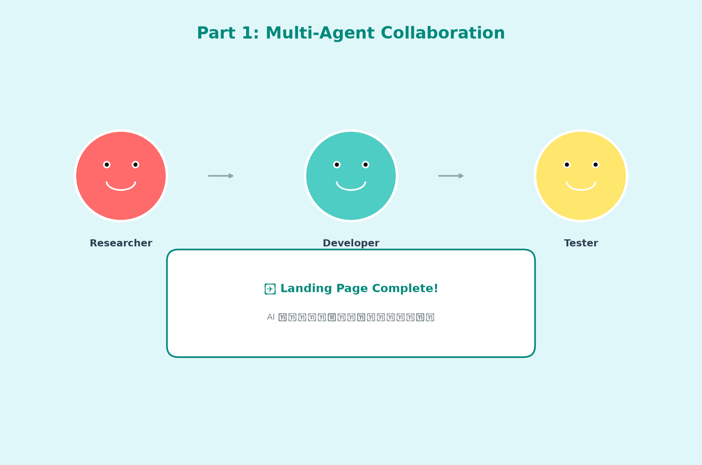
  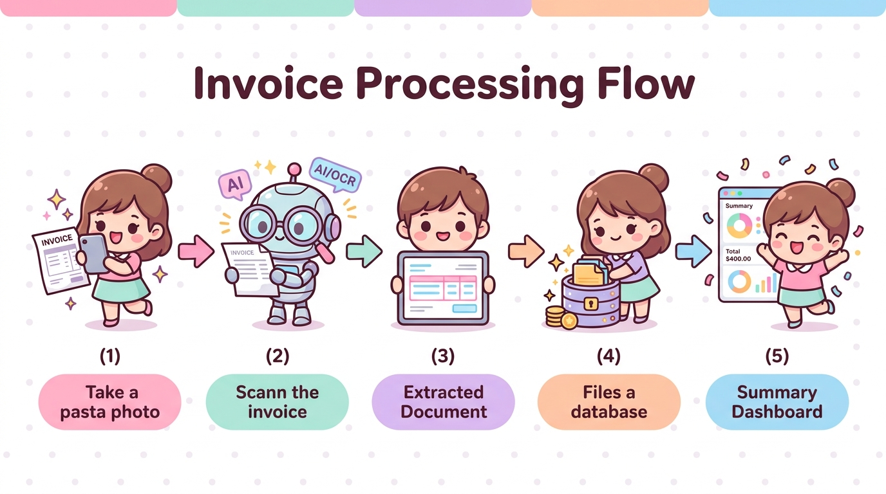
</div>

---

# 📊 ปัญหาของ SME

<div class="two-col">

<div class="kawaii-box">

## ❌ แบบเดิม (ทำเอง)
- รับ invoice กระดาษ → บันทึกเองใน Excel
- คำนวณยอดรวมเอง → ผิดบ่อย
- สรุปยอดรายเดือน → ใช้เวลา 2-3 ชม.
- หา invoice เก่า → ยากมาก

</div>

<div class="kawaii-box">

## ✅ แบบใหม่ (ให้ AI ทำ)
- ถ่ายรูป → AI อ่านอัตโนมัติ
- คำนวณยอด + VAT → ถูกต้อง `100%`
- สรุปยอดรายเดือน → 1 คลิก
- ค้นหา → พิมพ์คำว่า "ค่าไฟ" ก็เจอ

</div>

</div>

> 🌟 **ประหยัดเวลา `90%` — ไม่ต้องบันทึกเอง!**

---

# 🎯 Part 1: /goal + Kanban

## สร้างเว็บง่ายๆ ด้วย AI หลายตัว

<div class="two-col">

<div class="kawaii-box">

### สิ่งที่จะได้เรียนรู้
- ✅ `/goal` — สั่งงาน AI ให้ทำงานจนเสร็จ
- ✅ Kanban — หลาย AI ร่วมมือกัน
- ✅ Profiles — designer, developer, tester
- ✅ Dependencies — งานต่อกันอัตโนมัติ

</div>

<div>


</div>

</div>

---

# ทบทวน: `/goal` คืออะไร?

<div class="two-col">

<div class="kawaii-box">

## 🎯 Concept
> "บอก AI ว่าต้องการอะไร → AI ทำงานจนเสร็จ"

### ตัวอย่าง
```
/goal สร้าง landing page ร้านอาหาร
- มีเมนูอาหาร
- มีรูปภาพ
- รองรับ mobile
```

</div>

<div class="kawaii-box">

## 🎬 ผลลัพธ์
1. AI วิเคราะห์ความต้องการ
2. สร้าง HTML/CSS
3. เพิ่มรูปภาพ
4. ทดสอบ responsive
5. ✅ "เสร็จแล้ว!"

</div>

</div>

---

# เปรียบเทียบ: Hermes vs OpenAI

<div class="kawaii-box">

| | Hermes `/goal` | OpenAI `/goal` |
|---|---|---|
| **การทำงาน** | ต่อเนื่องจนเสร็จ | ทำครั้งเดียวแล้วจบ |
| **Orchestration** | มี Kanban, Cron | ไม่มี |
| **Multi-agent** | หลาย AI ร่วมมือ | AI เดียว |
| **Auto-retry** | มี (Auto-Heal) | ไม่มี |
| **เหมาะสำหรับ** | งานซับซ้อน | งานง่ายๆ |

</div>

> 💡 **Hermes = ทีม AI ทำงานร่วมกัน** | **OpenAI = AI เดียวทำงานคนเดียว**

---

# ตัวอย่าง: สร้างเว็บด้วย Kanban

<div class="two-col">

<div class="kawaii-box">

## 💬 แบบภาษามนุษย์ (ง่ายมาก!)

```
/goal สร้าง landing page สำหรับร้านอาหาร
โดยมีทีม AI 3 คน:
- researcher หาข้อมูลคู่แข่ง
- developer เขียนโค้ด HTML/CSS
- tester ทดสอบ responsive
```

**แค่นี้! AI จะจัดการทุกอย่างให้เอง**

</div>

<div class="kawaii-box compact">

## 🔧 แบบ Command (สำหรับสาย Tech)

```bash
hermes profile create researcher
hermes profile create developer
hermes profile create tester

T1=$(hermes kanban create "Research" \
     --assignee researcher --print-id)
T2=$(hermes kanban create "Develop" \
     --assignee developer --parent $T1 --print-id)
T3=$(hermes kanban create "Test" \
     --assignee tester --parent $T2 --print-id)

hermes kanban dispatch
```

</div>

</div>

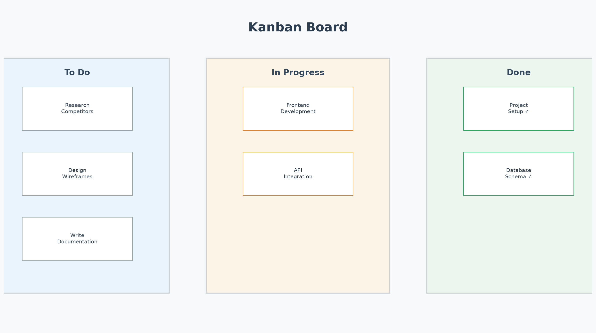

> 💡 **ทั้งสองแบบได้ผลลัพธ์เหมือนกัน — เลือกแบบที่ถนัด!**

---

# Lab 1: สร้าง Landing Page

<div class="two-col">

<div class="kawaii-box">

## 💬 แบบภาษามนุษย์

```
/goal สร้าง landing page สำหรับร้านอาหาร
- มีเมนูอาหารและรูปภาพ
- มีที่อยู่และเบอร์โทร
- รองรับมือถือ
- ให้ทีม AI 3 คนช่วยกัน:
  designer ออกแบบ, developer เขียนโค้ด, tester ทดสอบ
```

**แค่นี้! AI จะสร้าง profiles และ tasks ให้เอง**

</div>

<div class="kawaii-box compact">

## 🔧 แบบ Command (สำหรับสาย Tech)

```bash
hermes profile create designer
hermes profile create developer
hermes profile create tester

T1=$(hermes kanban create "Design" \
     --assignee designer --print-id)
T2=$(hermes kanban create "Develop" \
     --assignee developer --parent $T1 --print-id)
T3=$(hermes kanban create "Test" \
     --assignee tester --parent $T2 --print-id)

hermes kanban dispatch
```

</div>

</div>

> 🌸 **ทั้งสองแบบได้ผลลัพธ์เหมือนกัน — เลือกแบบที่ถนัด!**

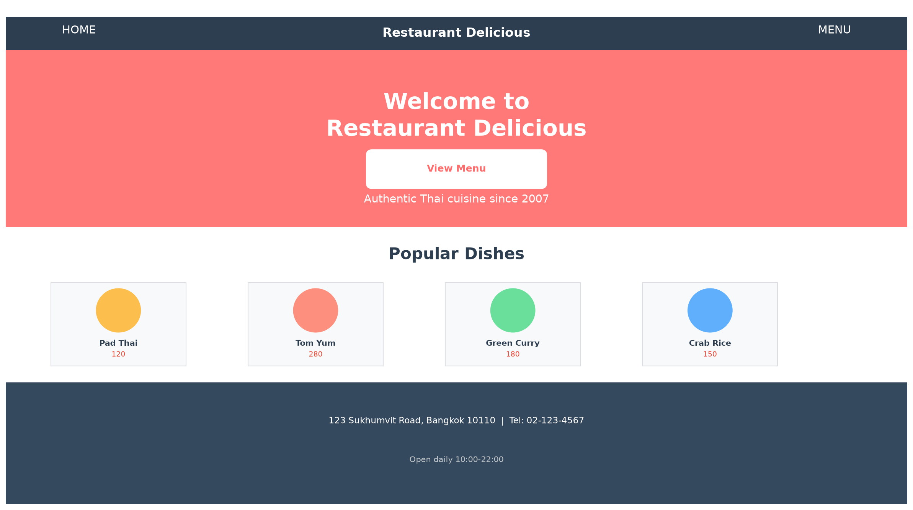

---

# สรุป Part 1

<div class="two-col">

<div class="kawaii-box">

## ✅ สิ่งที่ได้เรียนรู้

1. **`/goal`** — สั่งงาน AI ให้ทำงานจนเสร็จ
2. **Kanban** — หลาย AI ร่วมมือกัน
3. **Hermes vs OpenAI** — Hermes เหมาะกับงานซับซ้อน

</div>

<div class="kawaii-box">

## 🎯 สิ่งที่ได้ทำ

- ✅ สร้าง profiles (designer, developer, tester)
- ✅ สร้าง tasks พร้อม dependencies
- ✅ Dispatch และ monitor
- ✅ ได้ landing page สำเร็จ

</div>

</div>

> 🌟 **พร้อมไป Part 2 แล้ว!**

---

<!-- _class: lead -->

# 📄 Part 2: Invoice Processing

---

## ตัวอย่าง Invoice 6 ประเภท

<div class="invoice-full-grid">

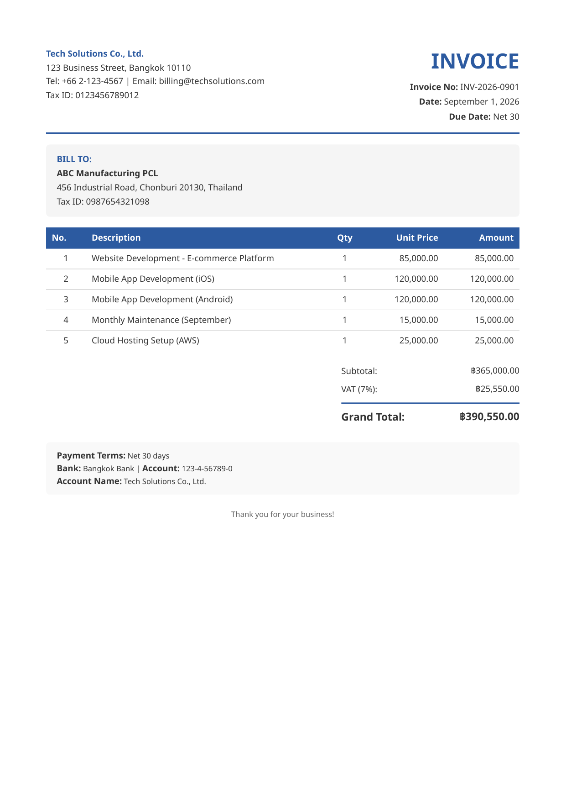
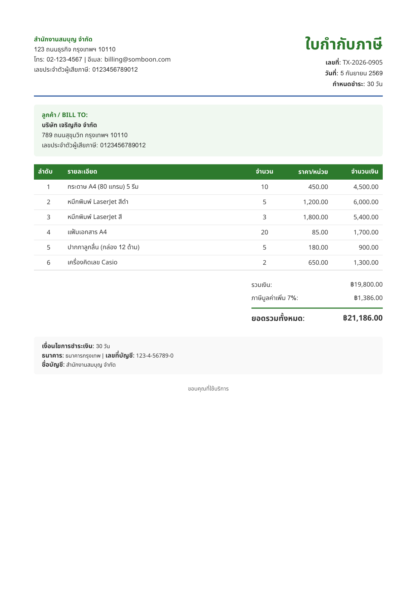
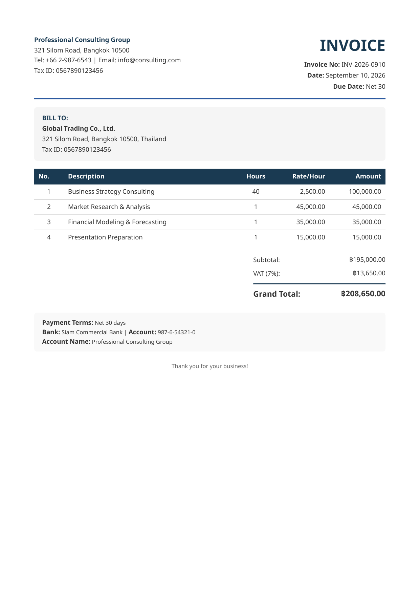
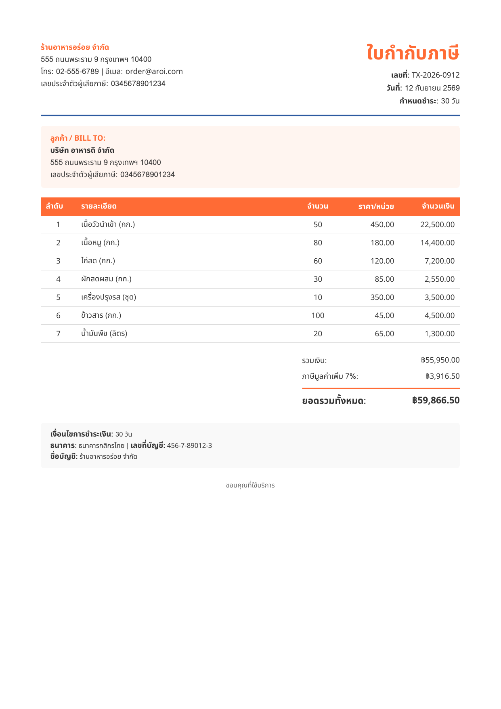
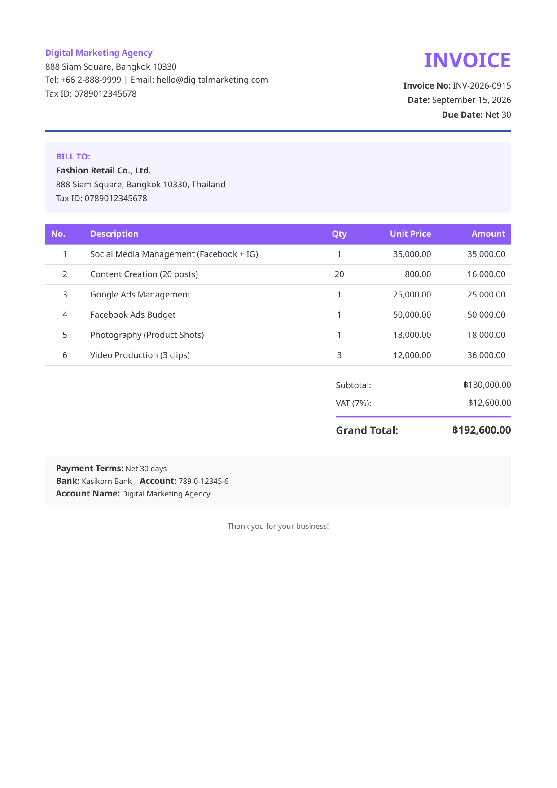
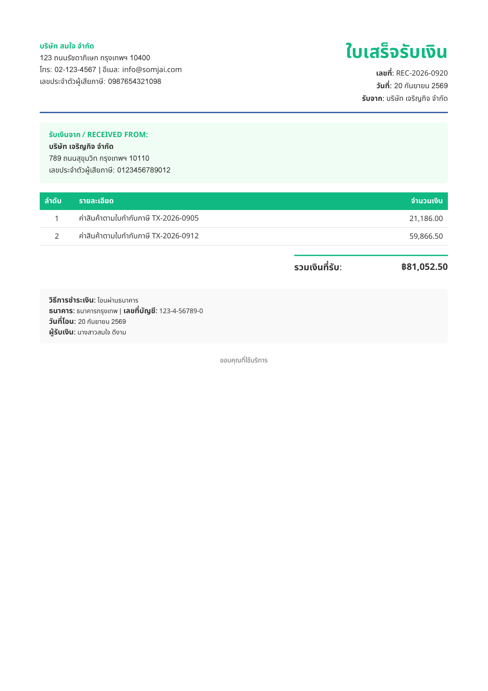

</div>

---

# เป้าหมาย Part 2

<div class="two-col">

<div class="kawaii-box">

## 🎯 สร้าง Web App ที่:
1. ถ่ายรูป invoice จากโทรศัพท์
2. AI อ่านข้อมูลอัตโนมัติ (OCR)
3. แสดงผลลัพธ์: เลขที่, วันที่, ยอดเงิน
4. บันทึกข้อมูลลง database
5. สรุปยอดตามประเภท

### 🛠️ เทคโนโลยี
- 🐍 Python (Flask/FastAPI)
- 🗄️ SQLite
- 🤖 AI OCR
- 📱 HTML5 Responsive

</div>

<div class="kawaii-box">

## 📋 ตัวอย่าง Invoice ที่มี


### 🔄 ขั้นตอนการทำงาน
```
📱 ถ่ายรูป → 🤖 AI อ่าน → 💾 บันทึก → 📈 สรุป
```

</div>

</div>

---

# Lab 2: สร้าง Web App

<div class="two-col">

<div class="kawaii-box compact">

## 📝 ตั้ง `/goal`

```bash
/goal สร้าง web app ประมวลผล invoice
- ใช้ Flask หรือ FastAPI
- มีหน้า upload รูป invoice
- ใช้ AI อ่านข้อมูล (OCR)
- แสดง: เลขที่, วันที่, ยอดเงิน, ประเภท
- บันทึก SQLite
- Dashboard สรุปยอดตามประเภท
- รองรับ mobile
```

</div>

<div class="kawaii-box">

## 🔄 Flow การทำงาน

```
📱 ถ่ายรูป/Upload
      ↓
🤖 AI อ่านข้อมูล (OCR)
      ↓
📊 แสดงผลลัพธ์
      ↓
💾 บันทึก SQLite
      ↓
📈 Dashboard สรุป
```

</div>

</div>

> 💡 **AI สร้างเว็บให้ — ไม่ต้องเขียนโค้ด!**

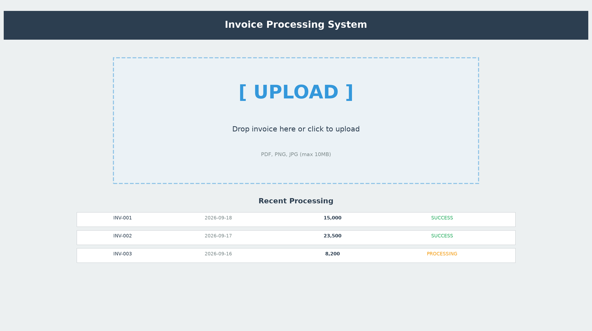

---

# Lab 3: ทดสอบกับ Invoice

<div class="two-col">

<div class="kawaii-box">

## 📝 ขั้นตอน

1. รัน Web App: `python app.py`
2. เปิด browser: `http://localhost:5000`
3. คลิก "Upload Invoice"
4. เลือกไฟล์ invoice
5. กด "Process"
6. รอ AI อ่านข้อมูล

</div>

<div class="kawaii-box">

## 📄 ตัวอย่าง Invoice ที่ใช้ทดสอบ


### ✅ ตรวจสอบผลลัพธ์
- เลขที่ invoice ถูกต้องไหม?
- วันที่ถูกต้องไหม?
- ยอดเงินถูกต้องไหม?

</div>

</div>

---

# Lab 4: ใช้กล้องโทรศัพท์

<div class="two-col">

<div class="kawaii-box">

## 📝 เปิดบนโทรศัพท์

1. หา IP: `ip addr show`
2. เปิด port 5000
3. โทรศัพท์เปิด: `http://YOUR_IP:5000`
4. กด "Upload from Camera"
5. ถ่ายรูป invoice
6. รอ AI อ่าน

</div>

<div class="kawaii-box">

## 💡 เคล็ดลับการถ่ายรูป

| ✅ ควรทำ | ❌ ไม่ควรทำ |
|---------|-----------|
| แสงสว่างเพียงพอ | ที่มืด |
| ถือกล้องให้ตรง | ถ่ายเอียง |
| ถ่ายทั้งใบให้ครบ | ถ่ายไม่ครบ |
| พื้นหลังเรียบ | พื้นหลังลายตา |

</div>

</div>

> 🌸 **ถ่ายรูป → AI อ่าน → เสร็จ!**

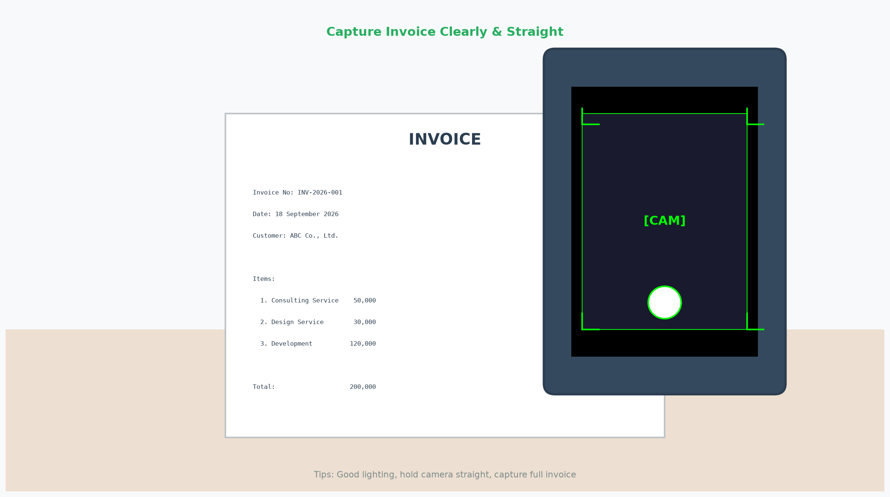

---

# Lab 5: เพิ่มฟีเจอร์

<div class="two-col">

<div class="kawaii-box compact">

## 📝 ตั้ง `/goal` เพิ่มฟีเจอร์

```bash
/goal ปรับแต่งระบบประมวลผล invoice
- แยกประเภทอัตโนมัติ
  (อาหาร, อุปกรณ์, บริการ)
- รายงานสรุปประจำเดือน
- Export Excel
- แจ้งเตือน LINE เมื่อเกินงบ
```

</div>

<div class="kawaii-box">

## 🎬 ผลลัพธ์ที่คาดหวัง

1. ✅ แยกประเภทอัตโนมัติ
2. ✅ รายงานสรุปประจำเดือน
3. ✅ Export Excel ได้
4. ✅ แจ้งเตือน LINE

### 📊 ตัวอย่าง Dashboard
```
💰 สรุปยอดเดือน ก.ย. 2569
───────────────────
🍔 อาหาร:    ฿45,000
📦 อุปกรณ์:  ฿28,500
🔧 บริการ:   ฿67,200
───────────────────
✅ รวม:     ฿140,700
```

</div>

</div>

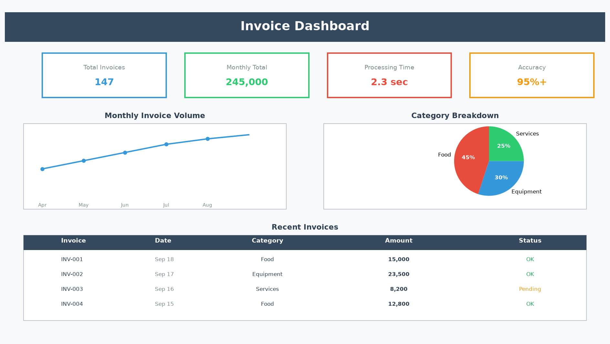

---

# Lab 6: Automation ด้วย Cron

<div class="two-col">

<div class="kawaii-box">

## 💬 แบบภาษามนุษย์

```
/cronjob ทุกวันจันทร์ 9 โมงเช้า
ให้สรุปยอด invoice สัปดาห์นี้
แบ่งตามประเภท
แล้วส่งรายงานทาง LINE
```

**แค่นี้! AI จะตั้ง cronjob ให้เอง**

</div>

<div class="kawaii-box compact">

## 🔧 แบบ Command (สำหรับสาย Tech)

```bash
cronjob create \
  --schedule "0 9 * * 1" \
  --prompt "สรุปยอด invoice
   สัปดาห์นี้ แบ่งตามประเภท
   ส่งรายงานทาง LINE" \
  --name "Weekly Summary"

# ทดสอบทันที
cronjob run <job_id>
```

</div>

</div>

> 💡 **ทั้งสองแบบได้ผลลัพธ์เหมือนกัน — เลือกแบบที่ถนัด!**

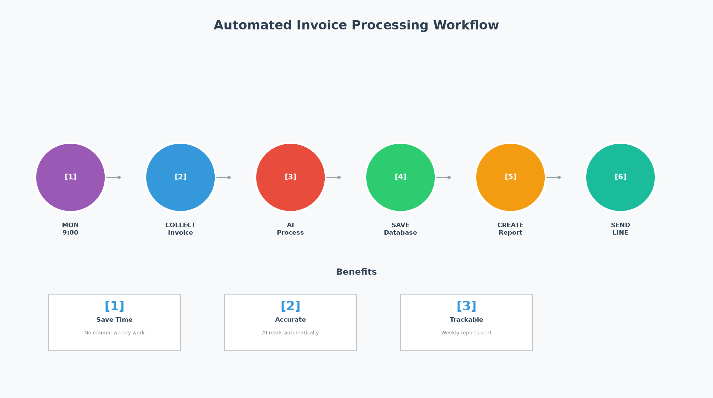

---

# สรุป Part 2

<div class="two-col">

<div class="kawaii-box">

## ✅ สิ่งที่ได้เรียนรู้

1. **สร้าง Web App** — ด้วย `/goal`
2. **OCR Invoice** — AI อ่านจากภาพ
3. **Mobile Camera** — ถ่ายจากโทรศัพท์
4. **Dashboard** — สรุปยอดตามประเภท
5. **Cron** — อัตโนมัติทุกสัปดาห์

### 📊 ผลลัพธ์
- ⏱️ เวลา: 1 ชม. | ✅ ถูกต้อง: `95%+` | 💰 ประหยัด: `90%`

</div>

<div class="kawaii-box">

## 💡 แนวทางพัฒนาต่อ

| ขั้นต่อไป | รายละเอียด |
|-----------|-----------|
| 🔗 Google Sheets | ส่งข้อมูลอัตโนมัติ |
| 📊 กราฟรายเดือน | ดูแนวโน้ม |
| 🔔 แจ้งเตือน LINE | เมื่อเกินงบ |
| 🤖 Auto-categorize | AI แยกประเภท |

### 🚀 ขั้นตอนต่อไป
1. ทดลองกับข้อมูลจริง
2. ปรับแต่งให้เหมาะกับงาน
3. เชื่อมระบบบัญชี

</div>

</div>

---

# 🎁 สรุปทั้งหมด

<div class="two-col">

<div class="kawaii-box">

## Part 1: /goal + Kanban
- ✅ `/goal` — สั่งงาน AI
- ✅ Kanban — หลาย AI ร่วมมือ
- ✅ Hermes vs OpenAI
- ✅ สร้าง landing page สำเร็จ

</div>

<div class="kawaii-box">

## Part 2: Invoice Processing
- ✅ สร้าง Web App ด้วย `/goal`
- ✅ OCR Invoice จากภาพ
- ✅ กล้องโทรศัพท์
- ✅ Dashboard + Cron อัตโนมัติ

</div>

</div>

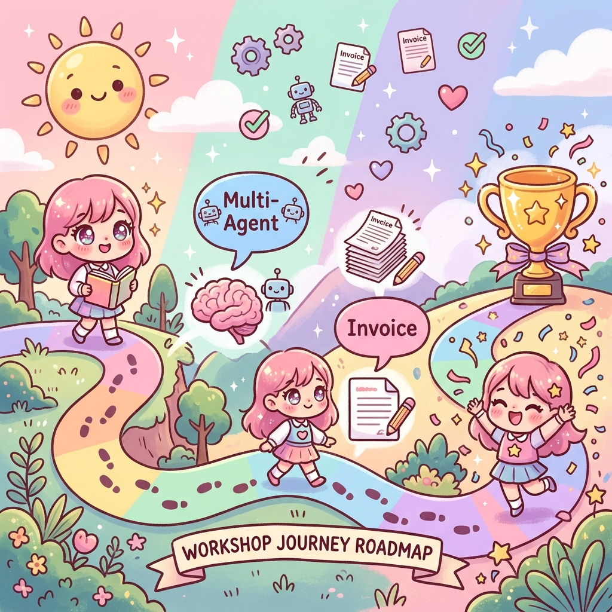

> 🌟 **คุณสร้างระบบประมวลผล Invoice สำเร็จแล้ว!**

---

# 📝 การบ้าน

<div class="kawaii-box">

## 🎯 ลองทำกับ Invoice จริง

### ขั้นตอนที่ 1: รวบรวม Invoice
- Invoice จาก suppliers / ใบเสร็จ / ใบกำกับภาษี

### ขั้นตอนที่ 2: อัพโหลดเข้าระบบ
- ถ่ายรูปจากโทรศัพท์ → อัพโหลด → ตรวจสอบ

### ขั้นตอนที่ 3: วิเคราะห์ข้อมูล
- ดู dashboard → Export Excel → วิเคราะห์ค่าใช้จ่าย

</div>

> 💡 **เริ่มจาก invoice 10 ใบ แล้วค่อยขยาย!**

---

# 🙏 ขอบคุณครับ

<div class="two-col">

<div class="kawaii-box">

## 📚 แหล่งข้อมูลเพิ่มเติม
- **Docs:** hermes-agent.nousresearch.com
- **GitHub:** github.com/NousResearch/hermes-agent
- **Community:** Discord Hermes Agent

</div>

<div class="kawaii-box">

## 🎁 สิ่งที่ได้กลับบ้าน
- ✅ ตัวอย่าง invoice 7 แบบ
- ✅ Web app ประมวลผล invoice
- ✅ Lab exercises ทั้งหมด
- ✅ ความรู้ในการสร้าง automation

</div>

</div>

> 🌸 **ขอให้สนุกกับการสร้างระบบอัตโนมัติ!** 🌸

---

<!-- _class: lead -->

# 🎉 ขอบคุณครับ!

## มีคำถามอะไรไหม?

📄✨🎯📋⏰🔁
